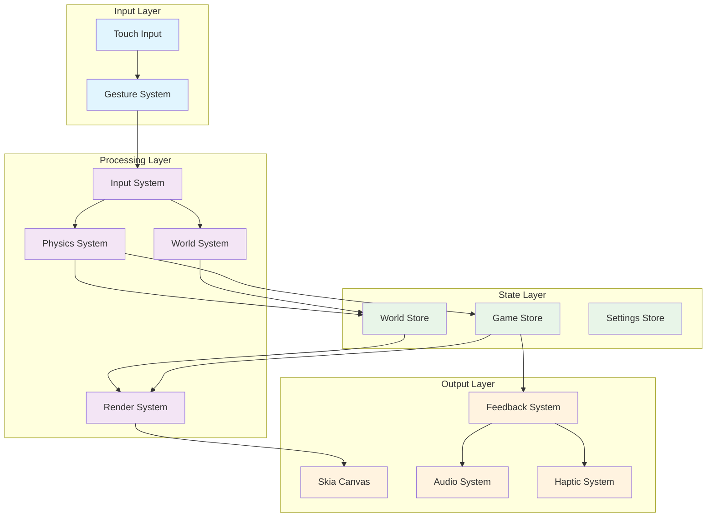
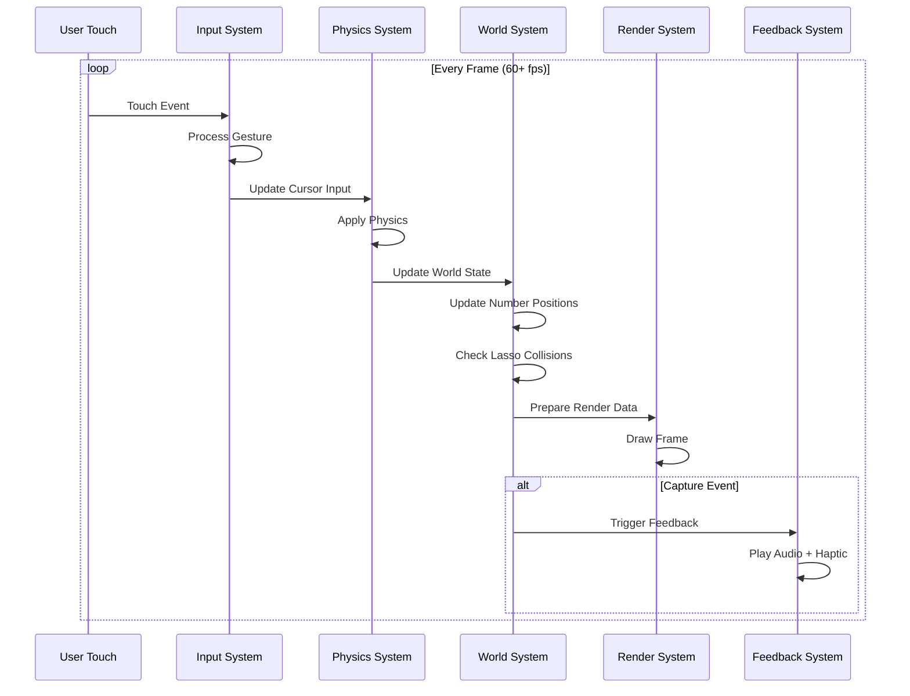
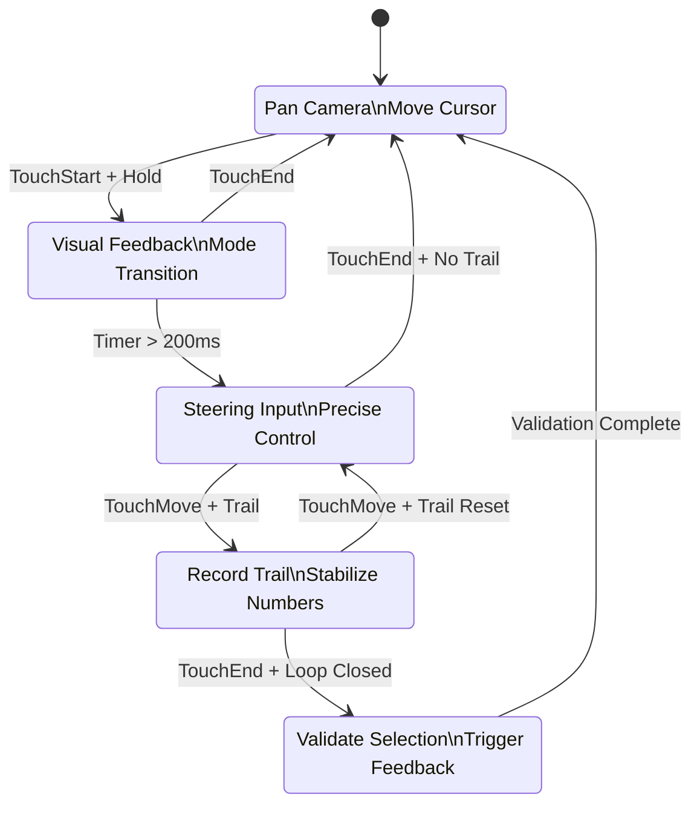

# MDR System Interaction Diagram

## Core System Flow



## Game Loop Architecture



## Input Mode State Machine



## Rendering Pipeline

```mermaid
flowchart TD
    Start([Frame Start]) --> Cull[Viewport Culling]
    Cull --> Numbers[Render Numbers]
    Numbers --> Lasso[Render Lasso Trail]
    Lasso --> Cursor[Render Cursor]
    Cursor --> UI[Render UI Elements]
    UI --> Effects[Apply Visual Effects]
    Effects --> Present[Present Frame]
    Present --> End([Frame End])
    
    subgraph Performance Optimizations
        Cull --> |Spatial Partitioning| CullOpt[Only Visible Entities]
        Numbers --> |Instanced Rendering| NumOpt[Batch Number Draws]
        Effects --> |GPU Shaders| EffOpt[Hardware Acceleration]
    end
    
    CullOpt -.-> Numbers
    NumOpt -.-> Lasso
    EffOpt -.-> Present